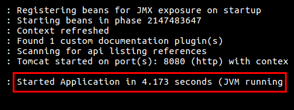

# Statistics API

API to collect transaction events and generate real time statistics for the last 60 seconds.

## Features
* Endpoint to collect events, every time a transaction is made;
* Endpoint to generate real time statistics from the last 60 seconds;
* Every data is stored in memory, very fast but will be lost once the service is shutdown;
* The endpoint for the statistics gets executed in O(1) time and space.

## Requirements
* JDK 8
* Docker (Optional)

## Running
It's possible to run the main application using the gradle wrapper in the applications's root 
directory.

From Linux or Mac command line:

    ./gradlew bootRun

From Windows command line:

    gradlew.bat bootRun

You know the application is up once you see the following text:

## Usage
    
The API has the following endpoints:

    http://localhost:8080/transactions  
    http://localhost:8080/statistics

The first one is used to collect the transaction events.

For a simple documentation and client you can access the address:

    http://localhost:8080/swagger-ui.html
    
It is a documentation of the API generated by springfox using swagger-annotation. 

## Documentation

**Javadocs**

To generate javadocs, run the following command:

    ./gradlew javadoc
    
The javadocs gets generated in the directory:

    build/docs/javadoc

**Jacoco Coverage**

To generate code coverage from jacoco, run the following command:

    ./gradlew test jacocoTestReport
    
The reports gets generated in the directory:

    build/reports/jacoco/test/html
    
**Sonarqube**

To generate all the docs at Sonarcloud, run the following command:

    ./gradlew sonarqube
    
The reports gets generated on Sonarcloud and can be accessed in the URL:

    https://sonarcloud.io/dashboard?id=br.com.pedront.n26%3AStatisticsApi
    
## Deploy

To build a docker image run the following command:

    ./gradlew docker

The image will have the name pedront/statistics-api and will be tagged latest.

The first version can be downloaded from Docker Hub using the following command:

    docker pull pedront/statistics-api

To run the docker image:

    docker run -it -d -p 8080:8080 pedront/statistics-api
